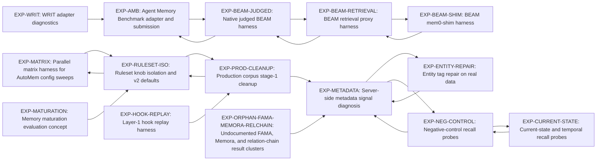

# Experiment Status

Generated: `2026-06-22T20:26:29+00:00`

This file is generated by `python3 scripts/experiment_index.py`.
Edit `docs/experiments/registry.json` instead of hand-editing this dashboard.

## Thread Overview

- `EXP-BEAM-SHIM` **BEAM mem0-shim harness** - `superseded`; The upstream BEAM runner can be pointed at AutoMem through a mem0-compatible shim. Decision: Superseded by EXP-BEAM-RETRIEVAL and EXP-BEAM-JUDGED; keep artifacts for historical comparison. Artifacts: 17. Updated: `2026-04-24`.
- `EXP-ORPHAN-FAMA-MEMORA-RELCHAIN` **Undocumented FAMA, Memora, and relation-chain result clusters** - `parked`; These result clusters likely represent real experiments, but the hypothesis and decision are not recorded in session notes. Decision: Keep parked until someone reviews the raw outputs and either backfills records or deletes the artifacts. Artifacts: 6. Updated: `2026-06-22`.
- `EXP-MATURATION` **Memory maturation evaluation concept** - `parked`; Recall quality may improve through maturation or consolidation processes beyond immediate ingestion. Decision: Parked until a concrete maturation runner is prioritized. Artifacts: 1. Updated: `2026-06-17`.
- `EXP-AMB` **Agent Memory Benchmark adapter and submission** - `in-progress`; AutoMem can be evaluated against external AMB datasets by adapting benchmark memory and recall calls into the server's native API. Decision: Keep in progress until the active AMB run finishes, aggregate its outputs, and decide whether to PR the amb-adapter worktree. Artifacts: 0. Updated: `2026-06-22`.
- `EXP-BEAM-JUDGED` **Native judged BEAM harness** - `in-progress`; AutoMem should be measured with BEAM's judged answer task, not only proxy retrieval metrics, to make leaderboard-comparable claims. Decision: Park promotion decisions until the active judged/AMB runs complete and the branch lands. Artifacts: 29. Updated: `2026-06-22`.
- `EXP-MATRIX` **Parallel matrix harness for AutoMem config sweeps** - `adopted`; A matrix runner with isolated stacks can compare many endpoints, rulesets, and scenarios without cross-run contamination. Decision: Adopted as infrastructure; no active worktree remains. Artifacts: 12. Updated: `2026-06-17`.
- `EXP-BEAM-RETRIEVAL` **BEAM retrieval proxy harness** - `adopted`; A deterministic retrieval-only BEAM proxy can provide a cheap signal before running expensive judged BEAM. Decision: Use as a cheap preflight, not as the final benchmark claim. Artifacts: 4. Updated: `2026-06-13`.
- `EXP-METADATA` **Server-side metadata signal diagnosis** - `adopted`; Better metadata treatment can improve /recall behavior on real-data probes without changing vectors. Decision: Adopt metadata A/B and vector identity checks as part of server-side recall diagnostics. Artifacts: 37. Updated: `2026-06-11`.
- `EXP-NEG-CONTROL` **Negative-control recall probes** - `adopted`; Negative controls can expose broad overfetch and unsafe recall wins that positive-only scenarios miss. Decision: Adopt as guardrail coverage for recall regression testing. Artifacts: 1. Updated: `2026-06-11`.
- `EXP-ENTITY-REPAIR` **Entity tag repair on real data** - `adopted`; Canonicalizing entity tags and rejecting unsafe metadata updates can improve recall without broad overfetch. Decision: Adopt staged repair evaluation before metadata migrations. Artifacts: 21. Updated: `2026-06-10`.
- `EXP-CURRENT-STATE` **Current-state and temporal recall probes** - `adopted`; Recall should prefer current facts over stale superseded facts when both exist. Decision: Use as a targeted regression harness for temporal validity. Artifacts: 18. Updated: `2026-05-22`.
- `EXP-WRIT` **WRIT adapter diagnostics** - `adopted`; WRIT-style history-aware adapter diagnostics can complement /recall scenario scoring. Decision: Keep as a supplemental benchmark harness, separate from official AutoMem benchmark claims. Artifacts: 42. Updated: `2026-05-22`.
- `EXP-HOOK-REPLAY` **Layer-1 hook replay harness** - `adopted`; Canned hook fixtures can detect capture-quality regressions before they reach production memory. Decision: Adopt as layer-1 regression coverage for ingestion hooks. Artifacts: 1. Updated: `2026-05-03`.
- `EXP-PROD-CLEANUP` **Production corpus stage-1 cleanup** - `adopted`; Noisy memory clusters can be identified and staged for deletion without damaging preserved recall scenarios. Decision: Adopt staged cleanup workflow for raw corpus pruning. Artifacts: 56. Updated: `2026-05-01`.
- `EXP-RULESET-ISO` **Ruleset knob isolation and v2 defaults** - `adopted`; Isolating recall knobs across the same scenarios can attribute quality changes to specific parameters. Decision: Adopt bare_tag_1m_v2 as the recommended local default; treat server-side expand_relations under tag gating as ineffective. Artifacts: 30. Updated: `2026-04-18`.

## Lineage

## In Progress / Needs Decision

- `EXP-AMB`: Keep in progress until the active AMB run finishes, aggregate its outputs, and decide whether to PR the amb-adapter worktree. (branch: `feat/amb-adapter`, worktree: `../automem-evals.worktrees/amb-adapter`).
- `EXP-BEAM-JUDGED`: Park promotion decisions until the active judged/AMB runs complete and the branch lands. (branch: `feat/beam-judged-harness`, worktree: `../automem-evals`).

## Worktree & Branch Reconciliation

- `feat/beam-judged-harness` at `/Users/jgarturo/Projects/OpenAI/automem-evals` - `in-flight`; no PR; dirty entries: `1`; keep/review.
- `feat/amb-adapter` at `/Users/jgarturo/Projects/OpenAI/automem-evals.worktrees/amb-adapter` - `in-flight`; no PR; dirty entries: `7`; keep/review.
- `feat/experiment-registry` at `/Users/jgarturo/Projects/OpenAI/automem-evals.worktrees/experiment-registry` - `open-pr`; PR #20 `OPEN`; dirty entries: `5`; keep/review.

Registry worktree refs that are not currently present:
- `EXP-MATRIX` expected `../automem-evals.worktrees/matrix-harness` for branch `feat/matrix-parallel-harness`.

## Benchmark Scores

Full interactive view: `docs/experiments/scoreboard.html` (open in a browser).

- `amb` BEAM-100K: `67.4% (spread 1.6pp, ×3/3)` (n=1120, recall 230 ms, 3843 tok).
- `amb` BEAM-10M: pending (`missing`, n=0).
- `amb` BEAM-1M: pending (`missing`, n=0).
- `amb` BEAM-500K: pending (`missing`, n=0).
- `amb` LoCoMo: `85.1% ± 1.8` (n=1540, recall 132 ms, 4768 tok).
- `amb` LongMemEval: pending (`missing`, n=0).
- `amb` PersonaMem: `76.1% ± 3.4` (n=589, recall 202 ms, 2588 tok).
- `beam-judged` 100K answerer `gpt-5`: latest `70.25%` (run `20260616-042452-1d46f08a`, 400 q).
- `beam-judged` 100K answerer `gpt-5-mini`: latest `0.0%` (run `20260617-121558-6099fa33`, 2 q).
- `beam-judged` 1M answerer `gpt-5-mini`: latest `70.0%` (run `20260616-221846-26f5f74b`, 20 q).

## Undocumented Runs

- `data/results/20260501-122106-prod-stage1-dry-run.md` - `artifact`; Production Stage 1 Cleanup Dry-Run
- `data/results/20260501-173242-graph-diagnostics.md` - `artifact`; Local AutoMem graph diagnostics - 2026-05-01T17:32:42
- `data/sweep_runs/20260501-062019-mirror8011-cleanup/dry2-sweep-memory-cache/summary.json` - `summary-json`; summary-json
- `data/sweep_runs/20260501-062019-mirror8011-cleanup/dry2-sweep-session-milestone/summary.json` - `summary-json`; summary-json
- `data/sweep_runs/20260501-062019-mirror8011-cleanup/exec-sweep-memory-cache/summary.json` - `summary-json`; summary-json
- `data/sweep_runs/20260501-093734-recall-compare-localhost-8011-vs-localhost-8011/summary.json` - `summary-json`; summary-json
- `data/sweep_runs/20260501-093827-recall-compare-localhost-8011-vs-localhost-8011/summary.json` - `summary-json`; summary-json
- `data/sweep_runs/20260501-173242-graph-diagnostics/summary.json` - `summary-json`; summary-json
- `data/sweep_runs/20260501-local-dry-memory-cache/summary.json` - `summary-json`; summary-json
- `data/sweep_runs/20260501-local-dry-session-milestone/summary.json` - `summary-json`; summary-json
- `data/sweep_runs/20260501-local-exec-memory-cache/summary.json` - `summary-json`; summary-json
- `data/sweep_runs/20260606-162441/summary.json` - `summary-json`; summary-json
- `data/sweep_runs/20260606-162501/summary.json` - `summary-json`; summary-json
- `data/sweep_runs/20260606-162514/summary.json` - `summary-json`; summary-json
- `data/sweep_runs/20260606-165450/summary.json` - `summary-json`; summary-json
- `data/sweep_runs/20260606-170328/summary.json` - `summary-json`; summary-json
- `data/sweep_runs/20260606-170942/summary.json` - `summary-json`; summary-json
- `data/sweep_runs/20260606-173839/summary.json` - `summary-json`; summary-json
- `data/sweep_runs/20260606-175951/summary.json` - `summary-json`; summary-json
- `data/sweep_runs/20260609-entity-repair-diagnostics-refresh-post-migration/recall-compare-post-migration/summary.json` - `summary-json`; summary-json
- `data/sweep_runs/20260609-entity-repair-local-loop-v7-sync-only/recall-compare-retry/summary.json` - `summary-json`; summary-json
- `data/sweep_runs/20260609-entity-repair-local-loop-v8-reject-only/recall-compare/summary.json` - `recall-endpoint-comparison`; recall-endpoint-comparison
- `data/sweep_runs/20260609-entity-repair-skip-restore-after-qdrant-retrieve-retry-sync-only/recall-compare/summary.json` - `recall-endpoint-comparison`; recall-endpoint-comparison
- `data/sweep_runs/20260609-entity-repair-strict-after-api-restart/recall-compare-post-migration/summary.json` - `summary-json`; summary-json
- `data/sweep_runs/20260609-entity-repair-strict-after-baseline-qdrant-sync/recall-compare-post-migration/summary.json` - `summary-json`; summary-json
- `data/sweep_runs/20260609-entity-repair-strict-after-score-change/recall-compare-post-migration/summary.json` - `summary-json`; summary-json
- `data/sweep_runs/20260609-entity-repair-strict-gate-check/recall-compare-post-migration/summary.json` - `summary-json`; summary-json
- `data/sweep_runs/20260611-211703-recall-compare-localhost-8121-vs-localhost-8122/summary.json` - `summary-json`; summary-json
- `data/sweep_runs/20260611-212035-recall-compare-localhost-8121-vs-localhost-8122/summary.json` - `summary-json`; summary-json
- `data/sweep_runs/entity-repair-20260606/recall-compare/summary.json` - `recall-endpoint-comparison`; recall-endpoint-comparison
- `data/sweep_runs/prod-rollout-20260610/canonicalize-v1/summary.json` - `summary-json`; summary-json
- `data/sweep_runs/prod-rollout-20260610/canonicalize-v2-executed/summary.json` - `summary-json`; summary-json
- `data/sweep_runs/prod-rollout-20260610/probes-post-repair/summary.json` - `summary-json`; summary-json
- `data/sweep_runs/prod-rollout-20260610/probes-pre-repair/summary.json` - `summary-json`; summary-json
- `data/sweep_runs/prod-rollout-20260610/reject-only-v3/summary.json` - `summary-json`; summary-json
- `data/sweep_runs/prod-rollout-20260610/reject-only-v4-executed/summary.json` - `summary-json`; summary-json
- `data/sweep_runs/prod-rollout-rehearsal-20260610-canonicalize-safe/recall-compare/summary.json` - `recall-endpoint-comparison`; recall-endpoint-comparison
- `data/sweep_runs/prod-rollout-rehearsal-20260610-post-migration/recall-compare/summary.json` - `recall-endpoint-comparison`; recall-endpoint-comparison
- `data/sweep_runs/prod-rollout-rehearsal-20260610-post-migration/recall-compare-post-migration/summary.json` - `summary-json`; summary-json
- `data/sweep_runs/prod-rollout-rehearsal-20260610-reject-only/recall-compare/summary.json` - `recall-endpoint-comparison`; recall-endpoint-comparison
- `data/sweep_runs/prod-rollout-rehearsal-20260610-sync-only/recall-compare/summary.json` - `recall-endpoint-comparison`; recall-endpoint-comparison
- `docs/session_20260423_failure_modes.md` - `session-note`; Session 2026-04-23 — V1 failure-mode forensics
- `docs/session_20260423_overnight_insights.md` - `session-note`; Session 2026-04-23 — Overnight insights: V1 vs V2 on BEAM 100K
- `docs/session_20260423_overnight_strategy.md` - `session-note`; Session 2026-04-23 — Overnight strategy (apples-to-apples)
